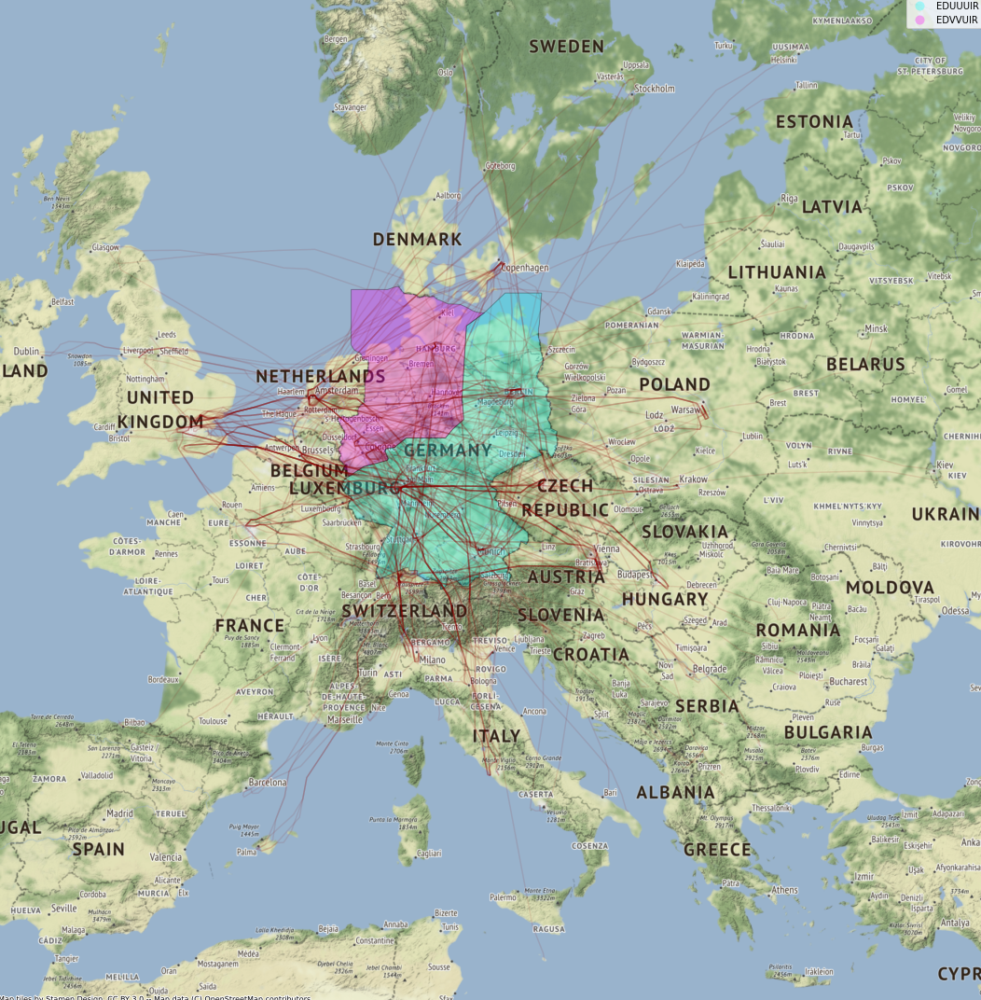
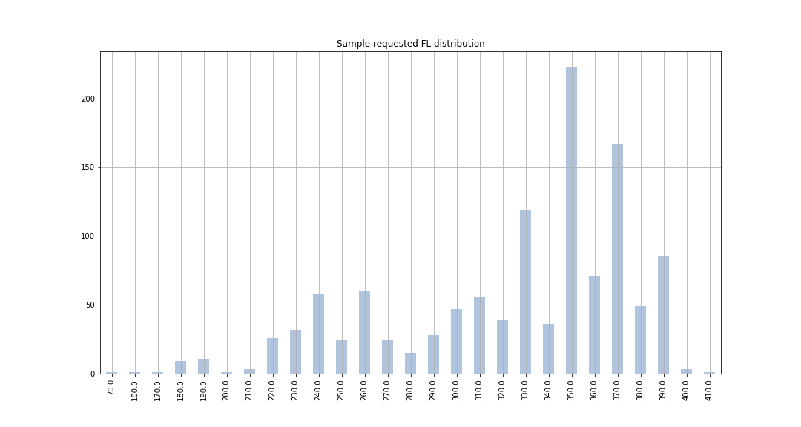

# EUROCONTROL R&D data archive

Load and visualize EUROCONTROL R&D data archive air traffic data with Python framework

Air traffic data are stored as [pandas](https://pandas.pydata.org/) / [GeoPandas](http://geopandas.org/) dataframes

The map background is built with [contextily](https://github.com/darribas/contextily)

Example 1: visualize EUROCONTROL R&D data archive sample

Example 2: visualize data archive extraction (set of short-haul flights over German upper airspace)

Example 3: analyze some flights data

## Running the tests

Run the following notebooks to load and visualize air traffic data:

* demo_sample: notebook to load and visualize the EUROCONTROL R&D data archive sample

* demo_archive_load: notebook to load an archive as pandas dataframes

* demo_archive_filtering: notebook to filter a data archive and export a smaller extraction

* demo_stats: notebook to load an archive and analyze some flights data with pandas tools

Run the

## Built With

* [pandas](https://pandas.pydata.org/) - Python Data Analysis Library

* [GeoPandas](http://geopandas.org/) - GeoPandas is an open source project which extends the datatypes used by pandas to allow spatial operations on geometric types. 

* [contextily](https://github.com/darribas/contextily) - Context geo-tiles in Python

## Authors

* **Thomas Dubot** 

## License

This project is licensed under the MIT License - see the [LICENSE.md](LICENSE.md) file for details

## Acknowledgments

EUROCONTROL R&D archive data & information can be found [here](https://www.eurocontrol.int/dashboard/rnd-data-archive)